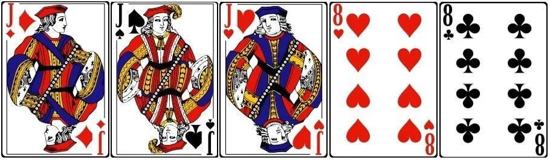
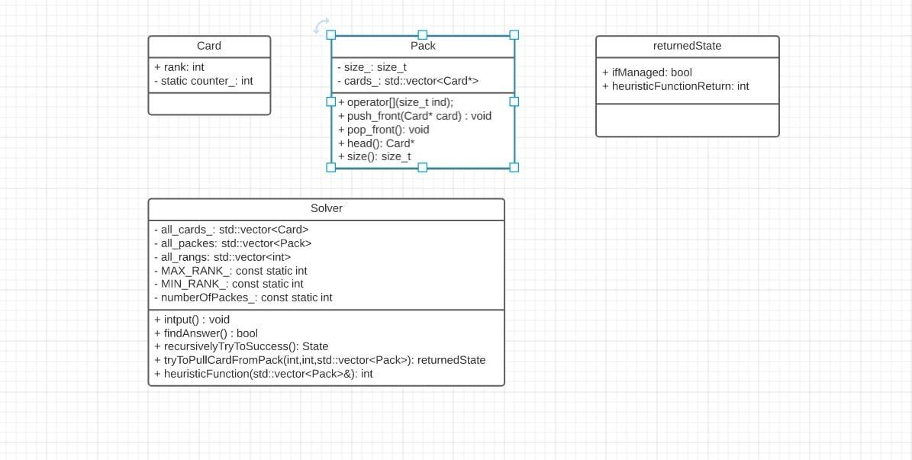

Тестовое задание для отбора на кафедру 1С
=========================================
#### Код задачи: 141

# Условие:
Две колоды карт (по 36 штук) соединяются и перемешиваются, а после раскладываются в 8 кучек по 9 карт. 

Можно работать только с верхними картами в каждой из кучек, а именно перекладывать одну или несколько последовательных карт меньшего номинала на карту большего (масти не учитываются). 
Если в одной из кучек оказалось 9 карт в правильном порядке (Напомню, туз-король-дама-валет-10-9-8-7-6), то этот набор убирается. 
Если из одной кучки убрали все карты, её всё ещё можно использовать и класть наверх любую карту. 
Необходимо реализовать программу, которая по информации об исходном состоянии восьми кучек посчитает, можно ли будет убрать все карты.
Формат ввода карт определите самостоятельно
# Формат входных данных:
  На вход подаются данные в порядке следования карт в столбце от закрытой к открытой. Для каждой карты нужно вывести ее масть(heart, diamond, club, spade) и ее ранг(от 6 до 14). Пример входных данных, если бы у нас был один столбец и 3 карты в нем.
  ```
  Sample:
    diamond 11
    spade 11
    heart 11
    heart 8
    club 8
  ```
  Такому сэмплу соответсвует следующая последовательность карт в столбце(8 крести будет открытой, остальные - закрыты):
  
# Формат выходных данных:
  *Yes* - если данный пасьянс удалось сложить, 
  
  *No* - если решение не найдено.
# Описание сущностей и интерфейса
  
# Описание алгоритма
  ***Обозначение:***  для каждой карты есть естественный номер от 6 до 14, будем называть его рангом.

  Будем делать рекурсивный перебор, оптимизированный эвристикой. Как будет выглядеть наша эвристика? Зададим эвристическую функцию ```heuristicFunction```, которая будет говорить нам какое состояние будет лучше. У алгоритма будут следующие шаги:
  * Наш алгоритм выбирает, начиная с какого туза он будет выстраивать карты в правильном порядке(от туза до шестерки).
  * Пусть на выбранном тузе мы выстроили первые n карт в правильном порядке, где n < 10. Тогда мы хотим освободить следующую карту и увеличить нашу цепочку до n + 1. Для каждой карты ранга 14 - n посчитаем значение эвристической функции. И будем пытаться освобождать эти карты в порядке убывания этих значений.
  * В случае если мы попадаем в ситуацию, когда мы не можем продолжить нашу текущую стопку - откатываемся назад( возвращаемся в ситуацию, когда в нашей цепочке было на одну карту меньше и пытаемся положить карту, на которое достигается следующее значение эвристической функции). 
# Асимптотика
